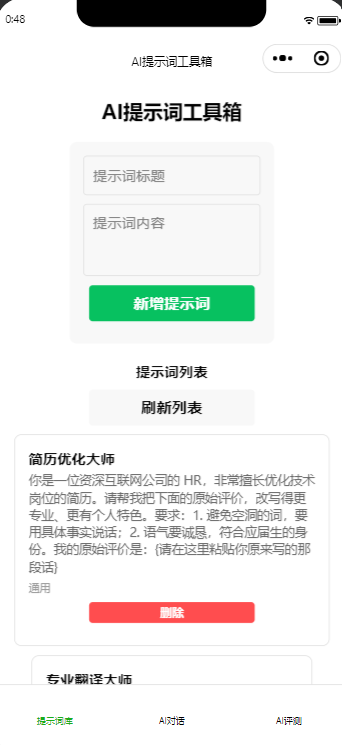
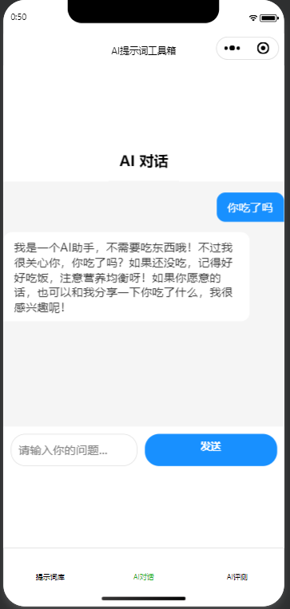
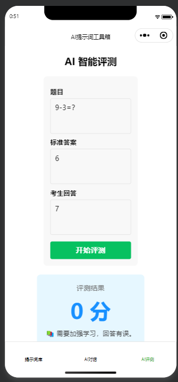

# AI Prompt 全生命周期管理与智能评测平台

## 项目简介
一个基于 **微信小程序 + Python FastAPI + MySQL** 的全栈 AI 应用。围绕 Prompt 的创建、验证与评估，提供**提示词库管理、AI智能对话、AI自动评测**三大核心功能。后端集成阿里云通义千问大模型，实现从 Prompt 沉淀到效果量化的完整闭环。

## 技术栈
- **前端**：微信小程序（WXML + WXSS + JavaScript）
- **后端**：Python FastAPI
- **数据库**：MySQL 8.0
- **AI服务**：阿里云通义千问 API (qwen-turbo)

## 功能模块
1.  **提示词库管理**：支持提示词的创建、查看与删除，实现 Prompt 资产的系统化沉淀。
2.  **AI对话**：在线调用大模型进行问答，快速验证提示词的实际效果。
3.  **AI评测**：输入题目、标准答案和考生回答，AI 自动打分并提供评语，量化评估 Prompt 效果。

## 项目结构
AI-Prompt-Lifecycle-Platform/
├── backend/              # Python FastAPI 后端
│   └── main.py           # 接口主程序
├── miniprogram/          # 微信小程序前端
├── database/             # 数据库文件
│   └── init_db.sql       # 建表语句
└── screenshots/          # 项目截图

## 项目预览
| 提示词库 | AI对话 | AI评测 |
|:---:|:---:|:---:|
|  |  |  |

## 开发者
- 计算机科学与技术 本科在读
- GitHub：[https://github.com/qiushanyue888](https://github.com/qiushanyue888)